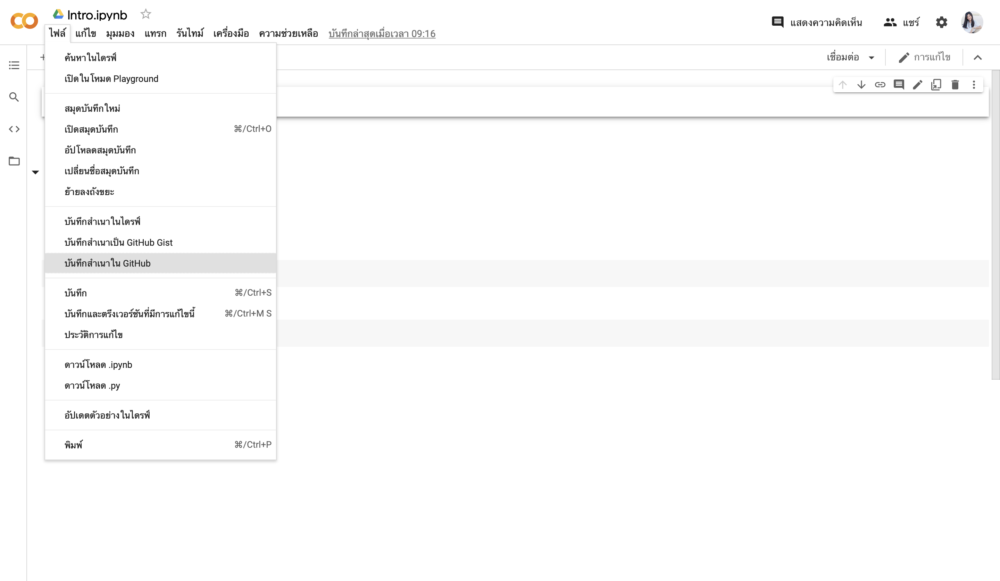
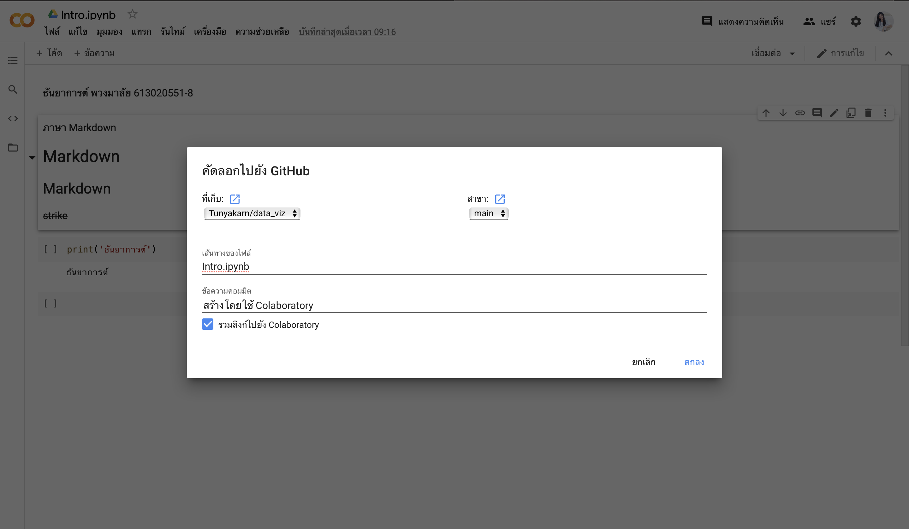

# data_viz

ธันยาการต์ พวงมาลัย 613020551-8

ตัวอย่างการแทรกรูป

ขั้นตอนการบันทึก colab ไปยัง github

ขั้นตอนที่ 1 คลิกคำว่า "ไฟล์" แล้วเลือก "บันทึกสำเนาใน GitHub" 

ขั้นตอนที่ 2 เมื่อเลือก "บันทึกสำเนาใน GitHub" แล้ว จะได้ตามรูปข้างล่าง ให้คิก "ตกลง"

